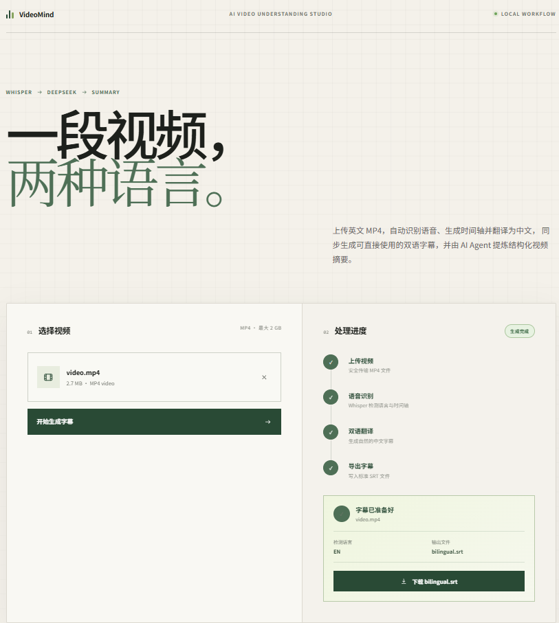
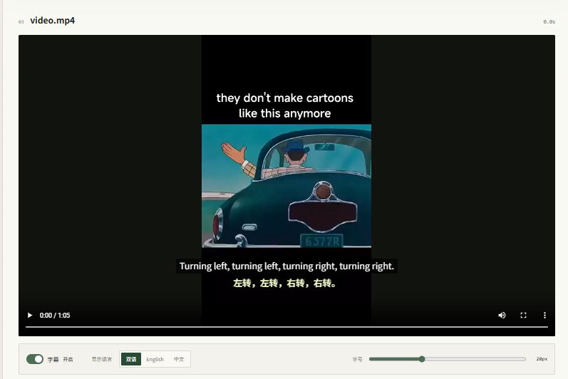
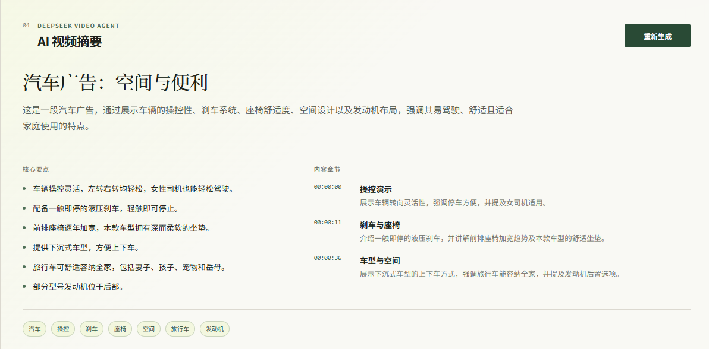
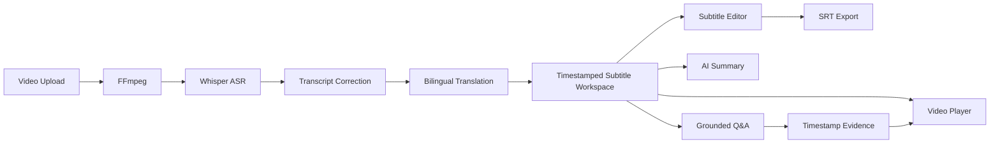

# VideoMind-Agent

## AI 视频理解与双语字幕智能工作台

> AI-powered video understanding and bilingual subtitle workspace.

[](https://github.com/PeterlearnC/VideoMind-Agent/releases/tag/v0.7.2)
[](#-tech-stack)
[](#-tech-stack)
[](#-competition--status)

长视频往往没有可用字幕，自动识别文本又可能包含 ASR 错误；跨语言理解、内容检索和信息定位仍需要在多个工具之间来回切换。即使使用 AI 进行总结或问答，回答也常常缺少可回到原视频核验的证据位置。

VideoMind-Agent 将 **语音识别 → 字幕校正 → 双语翻译 → 人工编辑 → AI Summary → Grounded Q&A → 时间戳跳转**整合到同一工作台，把线性视频转换为可搜索、可校正、可复用的结构化内容。

项目的核心设计是：**时间戳字幕是连接视频播放、字幕编辑、AI Summary 和 Grounded Q&A 的统一数据层。** AI 生成的内容可以通过 cue 和 timestamp 回到原视频核验，而人工保存后的字幕也会成为后续 Summary 与 Q&A 的最新上下文。

---

## 🖼️ Demo

### Video Upload



### Bilingual Subtitle Player



### AI Video Summary



> 仓库当前保留了上传、播放器和 Summary 三张真实 Demo 截图。Subtitle Editor 与 Grounded Q&A 可在本地启动后直接体验；参赛产品说明见 [`docs/competition/`](docs/competition/README.md)。

---

## ✨ Core Features

### 1. Automatic Speech Recognition

基于 Whisper 建立带时间轴的原始字幕层：

- 自动识别视频语音并检测源语言
- 通过 FFmpeg 完成音频抽取与媒体准备
- 保留 Whisper segment 的 `start` / `end` timestamps
- 生成结构化字幕数据与 SRT 时间轴

### 2. AI Transcript Correction

使用 DeepSeek 对 Whisper transcript 进行上下文校正：

- Context-aware batch correction
- JSON structured output 与分层容错解析
- Invalid model output 自动 retry
- Retry 失败时按 batch fallback
- Correction metadata 与性能统计
- 严格保护 segment ID 和原始时间轴

AI 只允许修改 `corrected_text`，不能修改 `start`、`end`，也不能合并、拆分或创建 cue。

### 3. Bilingual Subtitle Translation

当前支持以下语言代码及其跨语言字幕流程：

- 简体中文（zh）
- English（en）
- 日本語（ja）
- 한국어（ko）
- Русский（ru）

Translation pipeline 已实现：

- Context-aware batch translation
- 全局/相邻字幕上下文与基础 glossary 配置
- 数字和单位的 semantic value validation
- Segment ID validation
- Reordered ID 自动重排
- 当前 batch 局部 retry
- Split-batch recovery
- Per-segment fallback

这些机制用于提高结构化输出稳定性，不代表对翻译质量或准确率作绝对保证。

### 4. Human-in-the-loop Subtitle Editor

AI 提高处理效率，人工负责最终表达和质量控制：

- 搜索原文和译文，并高亮匹配关键词
- 查看 Whisper 原始文本、DeepSeek 校正、DeepSeek 翻译和人工修改记录
- 编辑原文或译文
- 单条保存、保存全部、撤销本地草稿、重置人工编辑
- `Ctrl + Enter` 保存当前 cue
- 未保存草稿状态与离开/重新生成防丢失确认
- 点击时间戳跳转视频
- 使用人工编辑后的 effective text 导出 SRT

所有人工文本编辑继续复用原始字幕时间戳。

### 5. Interactive Video Player

- 基于 `requestAnimationFrame` 读取真实 `video.currentTime`
- 播放器字幕和 SubtitleEditor 共用 active cue 判定
- Seek 后立即同步字幕与编辑器高亮
- 中文 / English / 双语显示切换
- 0.5x～2x 自定义播放倍速
- 当前字幕自动跟随；人工滚动、搜索或编辑期间暂停自动滚动
- 字幕位置自由拖动，并以相对百分比保存
- 字号与背景透明度调节
- `videomind.subtitlePreferences` 本地偏好持久化
- Workspace Restore：刷新后从后端字幕数据恢复最近工作区

**v0.7.2 新增 custom fullscreen mode。** 使用播放器下方的“全屏（字幕可见）”按钮时，video、SubtitleTrack 和字幕控制栏共同进入 fullscreen subtree；全屏状态下仍可显示、拖动和调整自定义字幕。

> 浏览器原生 `<video controls>` 的全屏按钮可能只让 video 元素进入全屏，无法保证显示外部自定义字幕。需要自定义字幕时，请使用 VideoMind-Agent 的“全屏（字幕可见）”按钮。

### 6. AI Video Summary

DeepSeek 基于完整 timestamped transcript 生成结构化结果：

- Title
- Video overview
- Key points
- Chapters
- Keywords

Chapter timestamp 由结构化字幕时间轴约束，前端可点击章节时间直接跳转回原视频。

### 7. Grounded Video Q&A

用户可以针对当前视频内容提问。Q&A agent 仅使用当前 timestamped subtitle workspace 作为上下文，并返回：

- 基于视频字幕的回答
- 相关 cue 证据
- 服务端从 cue ID 解析的 timestamp evidence
- 可点击的原视频跳转入口

核心交互链路：

```text
Answer → Evidence → Timestamp → Original Video
```

模型不直接编写证据时间戳；服务端根据模型选择的 `cue_id` 从字幕时间轴解析实际 `start`，降低模型自行生成错误时间位置的风险。

---

## 🏗️ Architecture



系统分为四个主要部分：

| Layer | Responsibilities |
|---|---|
| Frontend | React 工作台、HTML5 Video、字幕渲染、编辑器、Summary 与 Q&A 交互 |
| Backend | FastAPI API、媒体处理编排、字幕 workspace、校验与导出 |
| AI Services | Whisper ASR、DeepSeek Correction / Translation / Summary / Q&A |
| Data / Subtitle Workspace | 带时间戳的 structured subtitle JSON、SRT、人工 edited/effective text |

---

## 🛡️ Pipeline Reliability

### Transcript Correction

- 按 batch 校正，避免一次请求承载完整长视频
- 严格 JSON schema 与 segment ID 验证
- Invalid model output retry
- Retry 仍失败时回退至原始/已校正 baseline
- `start` / `end` 始终来自 Whisper

### Translation

- 数字与单位采用语义数值归一化校验，而不是跨语言字符串硬比较
- 分别识别 missing / extra / duplicate / malformed / reordered IDs
- ID 集合一致但顺序变化时，按 expected IDs 自动重排
- ID mismatch 只重试当前 translation batch
- 连续失败后拆分当前 batch
- 拆分后仍失败时仅对受影响 segment 逐条 fallback

因此，长视频某一个 Translation batch 出现结构异常时，系统会尽可能局部恢复，而不是重新执行已经完成的 Upload、FFmpeg、Whisper、Transcript Correction 和成功翻译批次。所有恢复策略仍可能失败，但失败范围和诊断信息会被结构化记录。

---

## 📊 Performance Validation

以下数据来自实际 Performance run，统计范围为服务端从任务开始到字幕 workspace 可用的 pipeline duration；不同硬件、模型服务响应和网络条件会产生不同结果。

| Test | Duration | Size | Resolution | Pipeline | Result |
|---|---:|---:|---:|---:|---|
| Short Video | 00:02:52 | 12.308 MB | 360×640 | 60.44 s | PASS |
| Medium Video | 00:15:41 | 325.252 MB | 1920×1080 | 175.95 s | PASS |
| Long Video — `Stanford_CS229_Lecture1.mp4` | 01:15:19 | 849.47 MB | 1920×1080 | 951.31 s | PASS |

### Long-video stage details

| Metric | Result |
|---|---:|
| Subtitle cues | 598 |
| Whisper | 619.21 s |
| Transcript Correction | 129.71 s |
| Translation | 196.59 s |
| Translation batches | 40 |
| Translation ID mismatches | 2 |
| ID retry successes | 2 |
| Failed segments | 0 |

75 分钟长视频测试中出现了 2 次模型 batch ID mismatch，均通过当前 batch 局部 retry 自动恢复，最终 pipeline 成功；没有重新执行 Whisper 或 Transcript Correction。

### Timeline inspection

- Short video coverage ratio：**99.983%**，历史 validator `passed=true`
- Medium video coverage ratio：**99.964%**，历史 validator `passed=true`
- Long video coverage ratio：**99.8955%**

长视频历史 Performance JSON 的严格浮点 validator 报告了 5 个 overlap。逐 cue 检查确认它们均为约 `2.84e-14～4.55e-13` 秒的 IEEE floating-point boundary artifact；相邻 SRT 毫秒边界保持一致，不存在实际可感知的字幕重叠。为忠实反映历史报告，这里不将该 run 描述为 `timeline_validation passed=true`。

Performance report 默认写入本地运行目录：

```text
backend/data/performance/<run_id>.json
backend/data/performance/latest.json
```

这些运行时报告由 `.gitignore` 排除，不提交视频、字幕正文或完整 Q&A 内容。

---

## ✅ Demo Validation

v0.7.2 已完成人工 Competition Demo 验收，覆盖：

- Video upload 与字幕生成
- 双语字幕和中文 / English 显示切换
- 播放同步、重复 seek 与播放倍速切换
- 字幕拖动、字号和背景透明度
- Subtitle Editor 搜索、编辑、保存、撤销、重置
- SRT export
- AI Summary 与 chapter timestamp seek
- Grounded Q&A 与 evidence timestamp seek
- Custom fullscreen subtitle
- Fullscreen → ESC → 恢复字幕位置、背景和字号偏好

Q&A Timestamp Seek 实测示例：点击 AI 回答证据中的 `00:29` 后，播放器可直接定位到 `00:29 / 00:55` 并显示对应字幕。

---

## 🧰 Tech Stack

| Area | Technologies |
|---|---|
| Frontend | React, Vite, JavaScript, CSS, HTML5 Video |
| Backend | Python, FastAPI, FFmpeg, ffprobe |
| AI | Whisper, DeepSeek API |
| Development | Git, GitHub, pytest, Node test runner |

---

## 🚀 Quick Start

### Prerequisites

- Python 3.10+（建议）
- Node.js 与 npm
- 系统 PATH 中可调用 `ffmpeg` 和 `ffprobe`
- DeepSeek API Key
- Whisper 运行所需模型环境（按当前本机环境配置）

### 1. Clone repository

```bash
git clone https://github.com/PeterlearnC/VideoMind-Agent.git
cd VideoMind-Agent
```

### 2. Backend environment

```bash
cd backend
python -m venv venv
```

Windows PowerShell：

```powershell
.\venv\Scripts\Activate.ps1
```

macOS / Linux：

```bash
source venv/bin/activate
```

### 3. Install backend dependencies

```bash
pip install -r requirements.txt
```

### 4. Configure environment

在 `backend/` 下从示例创建 `.env`：

```powershell
Copy-Item .env.example .env
```

或在 macOS / Linux 使用：

```bash
cp .env.example .env
```

至少配置：

```dotenv
DEEPSEEK_API_KEY=your_api_key_here
```

不要将真实 API Key 提交到 Git。

### 5. Start FastAPI backend

在 `backend/` 目录执行：

```bash
uvicorn app.main:app --reload --port 8000
```

健康检查：<http://127.0.0.1:8000/health>

### 6. Install and start frontend

打开另一个终端，在项目根目录执行：

```bash
cd frontend
npm install
npm run dev
```

访问：<http://127.0.0.1:5173>

Vite 会将 `/api` 请求代理到 `http://127.0.0.1:8000`。如需修改后端地址，可设置 `VIDEOMIND_BACKEND_URL`。

### Tests and production build

```bash
# Backend（项目根目录）
backend/venv/Scripts/python.exe -m pytest -q

# Frontend
cd frontend
npm test
npm run build
```

## Windows Quick Launch

对于普通用户、比赛评委和 Demo 演示，**推荐使用 Windows 一键启动**。完成首次环境准备后，无需手动分别打开 Backend 和 Frontend CLI，只需在项目根目录双击：

- `start_videomind.bat`：自动检查基础环境和配置，启动 FastAPI Backend 与 Vite Frontend，等待服务就绪并打开 <http://127.0.0.1:5173>。
- `stop_videomind.bat`：停止由启动脚本创建的 VideoMind-Agent Backend/Frontend 进程树，不删除视频、字幕、Performance reports 或其他用户结果。

首次运行前仍需准备：

- Python 3.11 与 backend dependencies
- Node.js/npm 与 `frontend/node_modules`（先运行 `npm install`）
- PATH 中可用的 FFmpeg 与 ffprobe
- 从 `backend/.env.example` 复制得到的 `backend/.env`
- DeepSeek API Key（Transcript Correction、Translation、Summary 和 Q&A 等 AI 功能需要）

一键启动脚本不是 installer，不会自动安装 Python、Node.js、FFmpeg 或项目依赖，也不会自动写入 API Key。缺少 `.env` 或 DeepSeek API Key 时脚本会给出警告；本地服务仍可启动，但相关 AI 功能可能不可用。

前文的 Backend/Frontend 手动启动命令继续保留，供开发者调试、查看独立日志或排查启动故障时使用。

---

## 📁 Project Structure

```text
VideoMind-Agent/
├── backend/
│   ├── app/
│   │   ├── api/          # FastAPI routes
│   │   ├── agents/       # Summary and grounded Q&A agents
│   │   ├── services/     # ASR, correction, translation, metrics, subtitles
│   │   ├── config/       # Environment, languages and pipeline settings
│   │   └── models/
│   ├── data/             # Ignored runtime performance reports
│   └── tests/
├── frontend/
│   ├── src/
│   │   └── components/
│   └── test/
├── data/                 # Ignored runtime video/audio/subtitle workspace
├── docs/
│   ├── competition/      # Editable competition deck and PDF
│   └── images/           # README Demo images
├── scripts/              # Competition material generation scripts
└── README.md
```

---

## 🏷️ Current Release

### VideoMind-Agent v0.7.2

**Competition demo stable release**

- Tag：[`v0.7.2`](https://github.com/PeterlearnC/VideoMind-Agent/releases/tag/v0.7.2)
- Commit：`11ef974`
- Commit message：`fix: preserve custom subtitles in fullscreen mode`

### Release milestones verified from Git history

| Version | Milestone |
|---|---|
| v0.3.0 | DeepSeek structured AI Video Summary |
| v0.4.0 | Timestamp seek navigation |
| v0.5.0 | Grounded Video Q&A with timestamp references |
| v0.5.1 | Video Q&A history UI |
| v0.6.1 | Multilingual subtitle pipeline、Transcript Correction 与 ASR proofreading improvements |
| v0.7.1 | Performance Metrics、Translation reliability、字幕拖动/背景/偏好设置 |
| v0.7.2 | Custom fullscreen subtitle support |

> Git 历史中没有独立的 `v0.6.0` tag；多语言和 Transcript Correction 的已标记稳定节点是 `v0.6.1`。

---

## 🗺️ Roadmap

以下均为未来规划，不是当前已经上线的能力：

- Online deployment 与运行环境标准化
- Authentication 与用户工作区隔离
- 自动化字幕质量评估
- 可视化、项目级术语表与 glossary 管理
- Multi-video semantic search
- 项目知识库
- 团队协作与审阅流程
- API / workflow integration

---

## 🏁 Competition / Status

当前状态：**Prototype / Competition Demo**

- 已完成 Short / Medium / Long video validation
- 已完成 v0.7.2 Demo acceptance test
- 已验证 75 分钟、849.47 MB 视频的完整 EN→ZH pipeline

项目仍处于原型与参赛 Demo 阶段，不应视为 production-ready SaaS。部署、安全、权限、质量评估和规模化运行仍需后续工程工作。

---

## Documentation

- [15 页可编辑参赛产品说明](docs/competition/README.md)
- [Competition PDF](docs/competition/VideoMind-Agent-参赛产品说明.pdf)
- [Competition PPTX](docs/competition/VideoMind-Agent-参赛产品说明.pptx)
