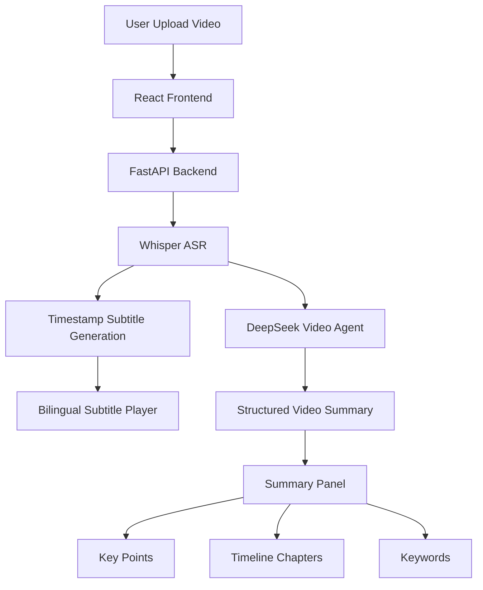

# VideoMind-Agent Architecture

## System Overview

VideoMind-Agent is an AI-powered video understanding system,
including video processing, bilingual subtitle generation and AI summary.

## Module Description

### Frontend

Technology:

- React
- Vite
- HTML5 Video Player

Functions:

- Video upload
- Subtitle rendering
- Real-time subtitle switching
- AI summary display

### Backend

Technology:

- FastAPI
- Python

Functions:

- Video processing API
- Subtitle generation
- DeepSeek Agent service
- Summary API

### AI Pipeline

Video

↓

Whisper Speech Recognition

↓

Subtitle Alignment

↓

DeepSeek Video Understanding

↓

Structured Summary

